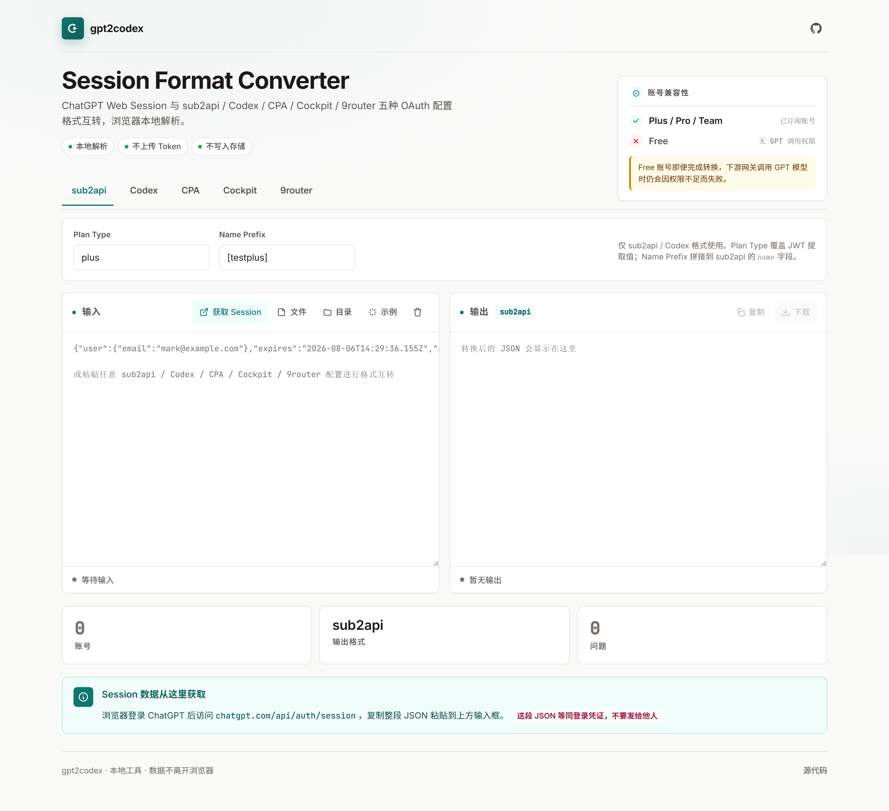

<div align="center">
  

  <h1>gpt2codex</h1>

  <p><strong>ChatGPT Web Session ⇄ 5 种 OAuth 配置格式互转器</strong></p>

  <p>
    <a href="#-特性">特性</a> ·
    <a href="#-用法">用法</a> ·
    <a href="#-支持格式">格式</a> ·
    <a href="#-隐私">隐私</a>
  </p>

  <p>
    
    
    
    
  </p>
</div>

---

## 📸 界面预览

<p align="center">
  
</p>

> 顶部品牌区 + 账号兼容性卡 → 5 种格式 Tab（带滑动下划线）→ 配置行（Plan Type / Name Prefix）→ 输入/输出双栏 → 实时校验诊断 → 统计卡片 → Session 获取指引。

---

## ✨ 特性

| | 能力 | 说明 |
|---|------|------|
| 🔄 | **5 种格式互转** | `sub2api` · `Codex` · `CPA` · `Cockpit` · `9router` 任意源 → 任意目标 |
| 🔒 | **完全本地解析** | 纯浏览器端 JavaScript，无后端请求；不上传 Token、不写入存储 |
| 🧠 | **智能输入识别** | 自动检测 ChatGPT Web Session / Codex `auth.json` / sub2api accounts / Cockpit / 9router 等结构 |
| ⚡ | **实时校验诊断** | JSON 行/列定位 + JWT 三段结构验证 + email 格式 + 时间字段有效性 |
| 📦 | **批量处理** | 拖拽多文件 + 文件夹选择（`webkitdirectory`）一次导入 |
| 🛡️ | **合成 id_token 兜底** | Web Session 通常无 `id_token`，自动生成 CPA/Codex/Cockpit 可解析的占位 claims |
| 🎨 | **优雅清爽 UI** | Swiss Modernism 设计语言 + Inter + JetBrains Mono · 流畅微交互 |

---

## ⚠️ 账号兼容性

| 账号类型 | 状态 | 说明 |
|---------|------|------|
| **Plus / Pro / Team** | ✅ 支持 | 已订阅账号，下游网关可正常调用 GPT 模型 |
| **Free** | ❌ 不支持 | 即便完成转换，下游网关调用 GPT 模型时会因权限不足失败 |

---

## 🚀 用法

### 本地使用

```bash
git clone https://github.com/Txy-Sky/gpt2codex.git
cd gpt2codex
# 浏览器直接打开 index.html，无需任何构建步骤
```

### 操作步骤

1. **登录 ChatGPT**：浏览器先登录 [chatgpt.com](https://chatgpt.com)
2. **获取 Session**：访问 [chatgpt.com/api/auth/session](https://chatgpt.com/api/auth/session)（或点击工具内「获取 Session」按钮）
3. **粘贴 JSON**：复制整段 JSON 粘贴到输入框
4. **选格式**：点击顶部 Tab 切换目标格式
5. **复制/下载**：右上角操作按钮

支持的输入：
- ✅ ChatGPT Web Session JSON
- ✅ sub2api 配置（多账号 accounts 数组）
- ✅ Codex CLI `auth.json`
- ✅ CPA 格式（扁平 codex 对象）
- ✅ Cockpit 格式
- ✅ 9router 格式

---

## 📋 支持格式

| 格式 | 用途 | 输出特点 |
|------|------|---------|
| **sub2api** | ChatGPT-to-API / sub2api 反代网关批量导入 | 完整 `accounts` 数组，含 `_token_version` · `client_id` · `organization_id` · `model_mapping`（gpt-5.1 ~ gpt-5.4 + codex 变体）· 17 个 codex 配额追踪 extra 字段 · `recharged` / `recharged_at` |
| **Codex** | OpenAI Codex CLI 本地配置 | `auth.json` 标准结构：`auth_mode` + `tokens{id_token, access_token, refresh_token, account_id}` + `last_refresh` |
| **CPA** | ChatGPT-Proxy-Api 代理 | 扁平 codex 类型对象，含 `account_id` · `email` · `plan_type` · `id_token` · `access_token` · `session_token` · `expired` |
| **Cockpit** | Cockpit 管理面板 | 含 `account_note` 字段，结构精简 |
| **9router** | 9router 路由网关 | `providerSpecificData{chatgptAccountId, chatgptPlanType}` + `createdAt` / `updatedAt` / `isActive` / `testStatus` |

### 字段映射可配置

- **Plan Type**：覆盖从 JWT 自动提取的 `plan_type` 字段（默认 `plus`）
- **Name Prefix**：拼接到 sub2api `name` 字段前（默认 `[testplus]`）

---

## 🔒 隐私

```
所有 JSON 解析、JWT 解码、格式转换均在浏览器本地完成。
此页面不发起任何向外部服务的网络请求。
Session Token 等同登录凭证，请妥善保管。
```

工具自身仅作本地数据加工，**不会**：
- ❌ 发送 Token 到任何服务器
- ❌ 写入 localStorage / cookies / IndexedDB
- ❌ 记录日志或埋点

---

## 🏗️ 技术栈

- **零依赖**：单 HTML 文件，仅外链 Google Fonts（Inter + JetBrains Mono）
- **JavaScript**：原生 ES2020，无 React/Vue/Webpack
- **CSS**：CSS Grid + Flexbox + 自定义属性，无 Tailwind/SCSS
- **图标**：内联 SVG，无图标字体

---

## 📁 文件结构

```
gpt2codex/
├── index.html              # 主入口（单页应用）
├── favicon.svg             # 品牌图标
├── docs/                   # 截图与文档资源
│   └── screenshot-fullpage.png
├── README.md
└── LICENSE
```

---

## 🤝 贡献

欢迎 Issue 与 PR。本工具核心已稳定，主要改进方向：
- 暗色模式
- 更多输入格式适配
- i18n 多语言

---

## 📜 License

[MIT](LICENSE) © 2026 Txy-Sky
